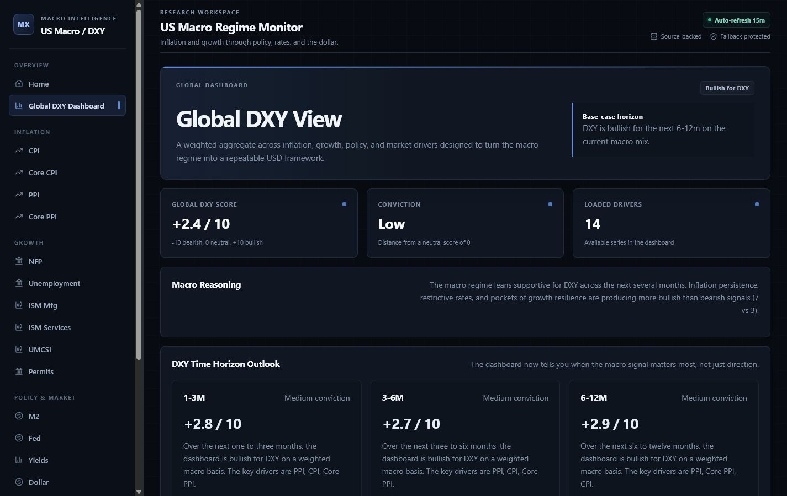
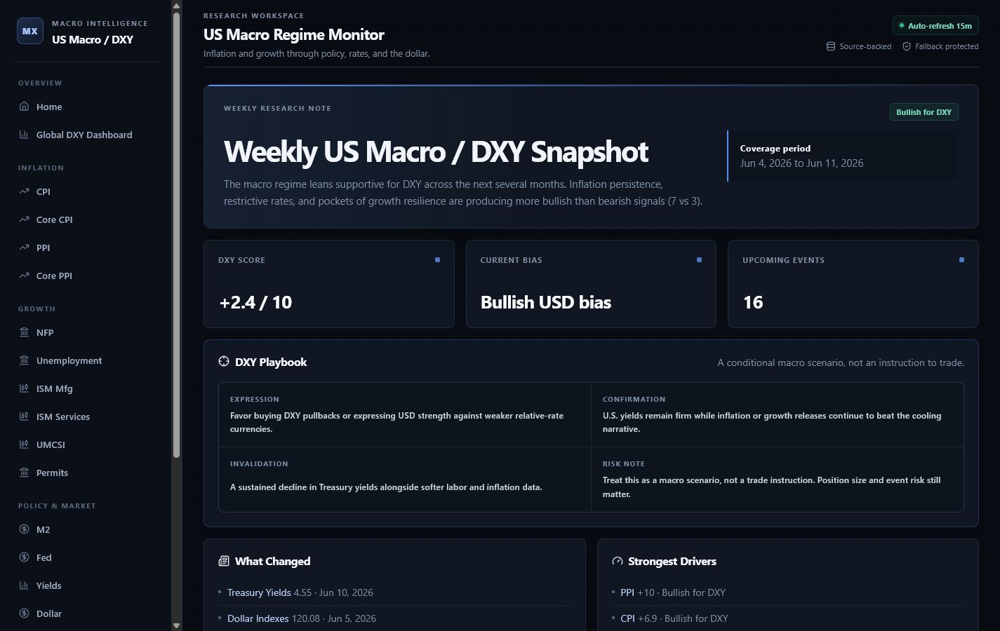
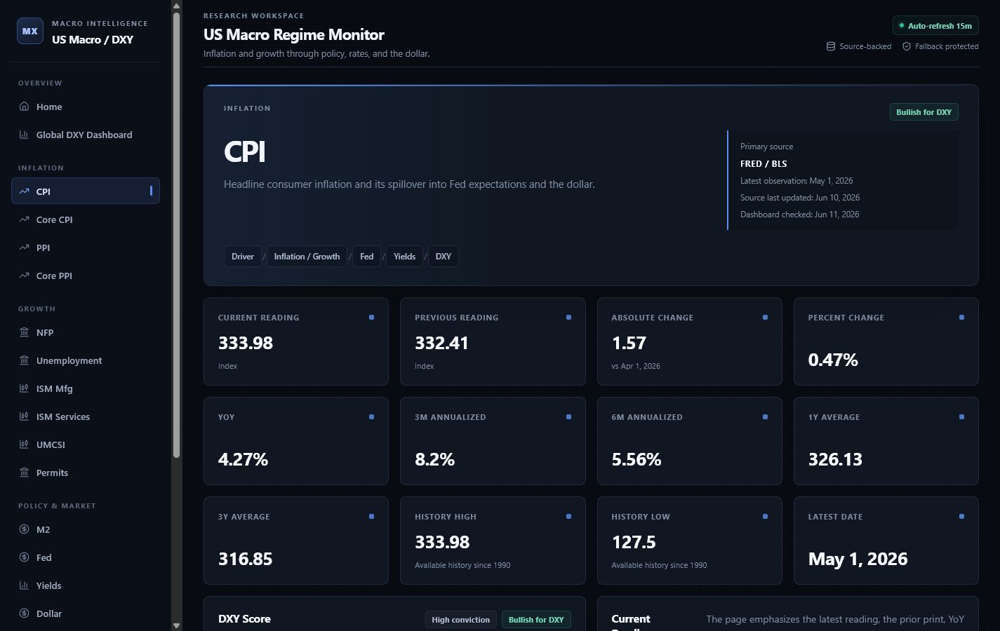

# Macro FX Monitor

Macro FX Monitor is a public, source-backed US macro dashboard that translates
inflation, growth, Federal Reserve policy, Treasury yields, and dollar data into
a transparent DXY regime.

The project includes:

- 14 automatically refreshed macro and market series
- weighted DXY scoring from -10 to +10
- one-to-three, three-to-six, and six-to-twelve-month scenario views
- a generated weekly/monthly macro snapshot
- an upcoming economic release calendar
- a conditional DXY playbook with confirmation and invalidation
- a double-opt-in public newsletter

## Live Demo

[macro-fx-monitor.vercel.app](https://macro-fx-monitor.vercel.app)

## Repository

[github.com/saadessahli/macro-fx-monitor](https://github.com/saadessahli/macro-fx-monitor)

## Product Preview

### Global DXY Dashboard



### Weekly Macro Snapshot



### Driver Research



## Screens

- `/dashboard` — global macro and DXY regime
- `/drivers/[slug]` — detailed driver research
- `/snapshot` — latest generated macro note
- `/newsletter` — free newsletter signup
- `/methodology` — scoring methodology
- `/data-sources` — source attribution and cadence

## Stack

- Next.js 15 and React 19
- TypeScript
- Recharts
- FRED API and public economic sources
- Supabase Free for generated snapshot persistence
- Buttondown for double-opt-in newsletter delivery
- Supabase Auth for the private admin workspace
- GitHub Actions for free scheduled publishing
- Vercel Hobby for public hosting

## Local Setup

```bash
npm install
copy .env.example .env.local
npm run dev
```

Add a FRED API key to `.env.local`. The development server defaults to
`http://localhost:3000`.

## Verification

```bash
npm run check
npm run lint
npm run build
npm audit --audit-level=high
```

The source health endpoint is available at `/api/data-status`.

FRED history is requested from 1990 onward to keep public cache entries within
free hosting limits while preserving the windows used by the model.

## Newsletter Architecture

1. A visitor submits the website form.
2. `/api/subscribe` proxies the request to Buttondown.
3. Buttondown creates an unconfirmed subscriber and sends its double-opt-in email.
4. Existing subscribers are not overwritten or silently reactivated.
5. Buttondown handles delivery and adds an unsubscribe link to newsletter emails.
6. GitHub Actions calls the protected snapshot endpoint weekly and monthly.
7. The endpoint generates the macro note, stores it in Supabase, and publishes
   it through Buttondown.

The signup API returns success only after Buttondown returns a valid subscriber
and a follow-up lookup confirms that the address is registered. Provider errors,
honeypot submissions, malformed requests, and missing configuration return
non-2xx responses. Runtime logs use a one-way email fingerprint rather than the
submitted address and include the request outcome, provider status, subscriber
ID, and Buttondown subscriber status for production debugging.

### Enable Newsletter Signup

Create a Buttondown newsletter and API key, then add this server-only variable
in Vercel under Project Settings > Environment Variables:

```text
BUTTONDOWN_API_KEY=your_buttondown_api_key
```

Apply it to Production and Preview, then redeploy. Never prefix this variable
with `NEXT_PUBLIC_`; the API key must not be available in browser code.

Buttondown's default double-opt-in setting must remain enabled. Supabase is not
required to collect subscribers. `SUPABASE_URL` and
`SUPABASE_SERVICE_ROLE_KEY` are only needed for generated snapshot persistence
and scheduled newsletter publishing.

To test the live flow, submit a new address on `/newsletter`, open the
Buttondown confirmation email, confirm the subscription, and verify that the
subscriber becomes active in Buttondown. Published Buttondown emails include
the provider-managed unsubscribe link.

For an end-to-end API check, verify all three cases:

1. An invalid email returns `400 INVALID_EMAIL`.
2. A new real address returns `201 SUBSCRIBER_CREATED` only after it appears in
   Buttondown, initially as unactivated when double opt-in is enabled.
3. Repeating the same address returns `SUBSCRIBER_EXISTS` without creating a
   duplicate.

Use Vercel runtime logs filtered by `newsletter-subscription` to diagnose
provider failures without exposing full email addresses or API keys.

## Deployment

See [docs/DEPLOYMENT.md](docs/DEPLOYMENT.md).

## Private Admin

The public dashboard does not expose admin navigation. `/login` uses
server-rendered Supabase password authentication, and `/admin/*` requires both
an authenticated session and an exact match with the server-only `ADMIN_EMAIL`.

Required Vercel variables:

```text
SUPABASE_URL=your_supabase_project_url
SUPABASE_ANON_KEY=your_supabase_anon_key
ADMIN_EMAIL=your_admin_email@example.com
```

Create the administrator as an email/password user in Supabase Auth. Keep
`ADMIN_EMAIL`, `SUPABASE_ANON_KEY`, and `SUPABASE_SERVICE_ROLE_KEY` free of the
`NEXT_PUBLIC_` prefix. The service-role key is not used by the browser or login
form. Administrator invitations return through `/auth/callback` to the private
`/set-password` activation page.

The private `/admin/marketing` route is an X Marketing Command Center. It never
publishes, replies, likes, follows, or sends direct messages automatically.
Every output requires administrator review and manual action on X.

### X Marketing Workflow

1. Sign in at `/login` with the approved administrator account.
2. Open `/admin/marketing`.
3. Review **Today's X Growth Plan** and select a recommended topic.
4. Choose a content type, topic, tone, and optional custom instruction.
5. Generate three scored variations: conservative, educational, and engagement.
6. Edit or improve the selected variation, then save it as a versioned draft.
7. Paste relevant X post text or a public X URL into **Reply Opportunities**.
8. Review and copy a suggested reply or post, then publish it manually on X.
9. Mark items as posted/replied and record performance later.

Every generated post is based on the latest stored weekly macro snapshot. The
agent scores clarity, relevance, hook strength, educational value, promotional
risk, financial-advice risk, and repetition risk. It warns about repeated,
overlong, vague, promotional, guaranteed, or buy/sell language.

### Optional AI Writing

The server-side writing provider uses the OpenAI Responses API when enabled:

```env
AI_ENABLED=true
OPENAI_API_KEY=your_server_only_key
AI_MODEL=gpt-5-mini
```

Do not prefix these variables with `NEXT_PUBLIC_`. When AI is disabled, missing,
or temporarily unavailable, the command center remains functional with its
adaptive deterministic fallback. Recent draft text, the selected topic and
tone, the latest snapshot, and the administrator's instruction are included in
generation context to reduce repetition.

### Reply Opportunities

Manual fallback mode is available without X API credentials. Paste public post
text and optionally its `x.com` URL and author. The server detects the topic and
creates three short manual-review options: concise, educational, and a
dashboard-related reply used only when natural. Copying never posts the reply.

`X_API_BEARER_TOKEN` is reserved for a future compliant recent-search adapter.
The current production implementation does not scrape X and does not perform
automatic discovery. The settings toggle is stored but discovery stays inactive
until a reviewed X API integration is added.

### Image Cards

The Visual Studio offers six X card directions and uses a separate off-screen
1600 x 900 export canvas, so downloaded content fills the PNG instead of
occupying a small preview corner. Image rendering remains browser-side.

### Video Preview and MP4 Rendering

The admin workspace includes a five-scene, 30-second animated preview:

- `0-2s`: "Here is what is driving the dollar today."
- `2-6s`: animated DXY score and current bias
- `6-14s`: top three drivers revealed one by one
- `14-22s`: confirmation and "But this bias breaks if..." invalidation
- `22-30s`: snapshot URL and educational-research disclaimer

Every video configuration includes a professional 45-75 word voiceover script.
The browser preview splits that script into subtitle-sized chunks and displays
the current chunk over the timed scene. The video panel shows whether subtitles
and music are enabled and provides a copyable voiceover.

**Download JSON config** downloads Remotion props, not a video. Replace
`remotion/sample-props.json` with the downloaded JSON, then generate the real
MP4 locally:

To preview or render the reusable Remotion template:

```bash
npm run video:studio
npm run video:render
```

The render command reads `remotion/sample-props.json` and writes the real video
to `out/macro-fx-update.mp4`. Local rendering is used because Vercel serverless
functions are not a reliable environment for Chromium-based, long-running MP4
renders. The interface does not label the downloaded JSON as a video.

Optional royalty-free, generated, or user-owned audio belongs in
`public/audio/`. No copyrighted audio is bundled. For example:

```json
{
  "musicEnabled": true,
  "musicUrl": "/audio/subtle-macro-bed.mp3",
  "musicVolume": 0.08
}
```

Leave `musicEnabled` false or `musicUrl` empty to render silently. Only use
royalty-free, generated, or personally owned music.

### Draft Storage

Apply both marketing migrations:

```text
supabase/migrations/20260612_marketing_drafts.sql
supabase/migrations/20260613_x_marketing_command_center.sql
```

The upgrade adds settings, versions, reply opportunities, quality scores,
copy/post history, and manual performance tracking. Row-level security is
enabled, browser roles have no table privileges, and all reads and writes go
through authenticated server-side admin endpoints.

Current limitations:

- Publishing and replying on X remain manual by design.
- X API search/discovery is not active in this version.
- PNG export runs in the administrator's browser.
- Production MP4 rendering is not enabled on Vercel.
- The Remotion template renders MP4 locally; a future upgrade can use Remotion
  Lambda or another dedicated render worker.
- Future automatic posting requires an X developer account, explicit posting
  approval, encrypted credentials, and an auditable publish queue.
- The optional AI layer writes copy only; visual and video data remain
  deterministic and source-backed.

## Data and Legal Notice

This product uses the FRED® API but is not endorsed or certified by the Federal
Reserve Bank of St. Louis.

Some data series available through FRED are owned by third parties and may be
subject to additional restrictions. This project is educational and does not
provide investment advice.

## License

The software is available under the [MIT License](LICENSE). Data-provider terms
and third-party data rights remain separate from the software license.
